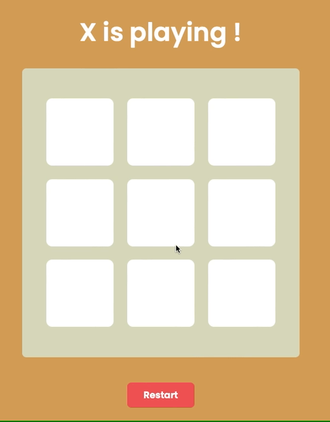

# Nuxt - TicTacToe  

<a href="https://github.com/Mouhcine-Flutter/ts-vue-tictactoe/blob/master/LICENSE"></a><a href="https://www.linkedin.com/in/mouhcine-sennaoui/"></a>

<!-- ABOUT THE PROJECT -->
## About The Project

A simple TicTacToe made with Nuxt TS



### Built With

* [Nuxt](https://nuxtjs.org/)
<!-- GETTING STARTED -->
## Getting Started

### Prerequisites
* npm
  ```sh
  npm install npm@latest -g
  ```

### Installation

1. Clone the repo
   ```sh
   git clone https://github.com/mouhcine-flutter/ts-vue-tictactoe.git
   ```
2. Install NPM packages
   ```sh
   npm install
   ```
3. Run app locally : http://localhost:3000
   ```sh
   npm run dev
   ```
<!-- LICENSE -->
## License

Distributed under the MIT License. See `LICENSE` for more information.